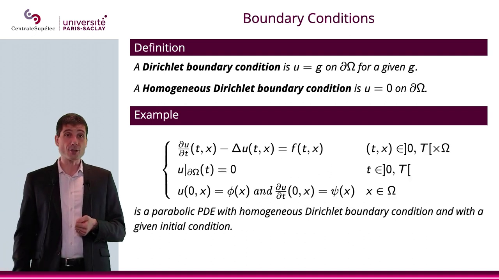

### Summary of Partial Differential Equations (PDEs) and Initial Value Problems

In the realm of Partial Differential Equations (PDEs), the concept of initial value problems extends from Ordinary Differential Equations (ODEs) in dimension 1. In the case of PDEs, which operate in higher dimensions, we encounter initial conditions and boundary conditions. 

#### Initial Conditions
When the PDE problem involves time dependency, initial conditions are crucial. These conditions focus on determining the state of the system at specific time points, such as at t=0 or t=t0.

#### Boundary Conditions
Boundary conditions, on the other hand, define the behavior of the PDE on the boundary of the system. This could involve specifying the values of the unknown variable on the boundary.

In essence, while initial conditions mark the starting point for the system, boundary conditions ensure the PDE accurately models the evolution of the system within its defined boundaries.

---

By John Cagnol  
Université CentraleSupélec | PARIS-SACLAY


### Understanding Partial Differential Equations (PDEs)

In the realm of differential operators and PDEs, the relationship between the operator A and the equation AU equals F, where F represents the given data and U the unknown, is paramount. The boundary condition serves as a crucial element that must be satisfied on the boundary or a specific part of it.

### The Significance of Conditions in PDEs

When dealing with PDEs, it's essential to acknowledge the presence of an infinite number of solutions. This complexity underscores the importance of not only formulating the PDE but also incorporating the necessary conditions.

- **Initial Condition (Cauchy Problem):** This condition pertains to the value at t = 0 in the context of evolution equations.

- **Boundary Conditions:** These conditions specify the value on the boundary, denoted as 0Q in the problem domain.

By recognizing and appropriately addressing these conditions, one can navigate the landscape of PDEs with clarity and precision.


### Boundary Conditions in Partial Differential Equations

In the study of partial differential equations (PDEs), boundary conditions play a crucial role in determining the behavior of the solution within a given domain. These conditions specify the values or properties that the solution function must satisfy on the boundary of the domain.

#### Definition

Given a regular open set $Q \subset \mathbb{R}^n$ of class $C^1$, consider a PDE of the form $Au = f$ on $Q$, where $A$ is a differential operator, $u$ is the unknown function, and $f$ represents the data associated with the problem.

#### Boundary Condition

The boundary condition (B.C.) for a PDE is an equation that the solution function $u$ must satisfy on the boundary $\partial Q$ or a part of it. This condition typically involves prescribing the value of $u$ on the boundary or specifying other properties that the solution must exhibit.

In the case where the prescribed value of $u$ on the boundary is 0, we refer to it as a homogeneous Dirichlet boundary condition.

#### Example

To illustrate, let's consider a very simple equation where $u = g$ on the boundary $\partial Q$ for a given function $g$. By prescribing the value of $u$ on the boundary, we establish a boundary condition that guides the behavior of the solution within the domain.

By understanding and applying appropriate boundary conditions, we can effectively solve PDEs and analyze the behavior of solutions in various physical and mathematical contexts.


### Understanding Elliptic PDEs with Boundary Conditions

In the realm of mathematics and mechanics, the elliptic partial differential equation (PDE) represented as "minus the Laplace U equals F" with a prescribed boundary condition of U equaling 0 defines a homogeneous Dirichlet boundary condition. This condition plays a pivotal role in various applications, such as mechanics.

#### Significance of Boundary Conditions

In mechanics, the boundary condition U equals 0 signifies the attachment of the modeled object to the boundary. This condition acts as a representation of attachment, where the prescribed value, whether it be displacement or another parameter, provides a clear understanding of the system's behavior at the boundary.

#### Application in Modeling

For instance, in the context of mechanics, setting U equals 0 or U equals G on the boundary allows for a precise definition of the displacement at that boundary point. This level of specificity aids in accurately modeling and simulating the behavior of the system under consideration.

---

% i unversite Boundary Conditions

CentraleSupélec | PARIS-SACLAY

Definition

A Dirichlet boundary condition is u = g on OQ for a given g.

A Homogeneous Dirichlet boundary condition is u = 0 on OQ.



### Heat Equation Description

In section 3.1 of this chapter, we delve into the heat equation, a fundamental concept in understanding temperature dynamics within a room. The equation takes the form:

```
∂U/∂t - ∇^2U = F
```

Here, `F` represents the heat source, and `U` denotes the temperature. By solving this equation, we aim to determine the temperature distribution in the room over time.

### Boundary Conditions

#### Dirichlet Boundary Condition

A Dirichlet boundary condition involves prescribing the temperature (`u = g`) on the boundary (`OQ`) of the room. This condition allows us to establish the initial temperature distribution.

#### Homogeneous Dirichlet Boundary Condition

In contrast, a Homogeneous Dirichlet boundary condition is characterized by `u = 0` on `OQ`. This condition sets the temperature to zero on the boundary, offering a different perspective on temperature analysis.

### Elliptic Partial Differential Equation

The equation `-∆u(x) = f(x)` with `u|∂Ω = 0` represents an elliptic PDE with a homogeneous Dirichlet boundary condition. This formulation plays a crucial role in exploring temperature dynamics within a defined space.

By understanding and applying these boundary conditions, we can effectively model and analyze temperature variations in a given environment.


### Boundary Conditions in Parabolic PDEs

In the study of Parabolic Partial Differential Equations (PDEs), boundary conditions play a crucial role in defining the behavior of the solution within a given domain. Two common types of boundary conditions encountered are Dirichlet boundary conditions and Homogeneous Dirichlet boundary conditions.

#### Dirichlet Boundary Condition

A Dirichlet boundary condition is characterized by setting the function \( u \) equal to a given function \( g \) on the boundary \( OQ \). Mathematically, this condition can be expressed as \( u = g \) on \( OQ \).

#### Homogeneous Dirichlet Boundary Condition

On the other hand, a Homogeneous Dirichlet boundary condition is a special case where the function \( u \) is set to zero on the boundary \( OQ \). This condition is denoted as \( u = 0 \) on \( OQ \).

### Mathematical Representation

For a parabolic PDE of the form \( u_t - Au = f(t, x) \) with \( (t, x) \in ]0, T[ \) and \( x \in \Omega \), where \( \Omega \) represents the spatial domain, the boundary conditions and initial conditions are given as follows:

- Homogeneous Dirichlet boundary condition: \( u|_{\partial \Omega} = 0 \) for \( t \in ]0, T[ \)
- Initial conditions: \( u(0, x) = \phi(x) \) and \( u_t(0, x) = \psi(x) \) for \( x \in \Omega \)

Understanding and appropriately applying these boundary conditions are essential in solving parabolic PDEs with accuracy and efficiency.


### Neumann Boundary Conditions

In the field of mathematical modeling, Neumann boundary conditions are often used to describe the behavior of a system at its boundaries. Specifically, a Neumann boundary condition can be defined as 3u = g on 00 for a given g. This condition provides valuable insights into the dynamics of the system under study.

### Homogeneous Neumann Boundary Conditions

A special case of Neumann boundary conditions is the Homogeneous Neumann B.C., which is represented as 5u = 00nd. This condition plays a crucial role in certain types of mathematical analyses and simulations.

### Boundary Conditions in Mathematical Modeling

When analyzing systems that are not in equilibrium, such as in terms of temperature distribution (Tx) or heat flux, boundary conditions become essential. By considering the flux of heat at the boundaries rather than prescribing specific temperature values, a more comprehensive understanding of the system's behavior can be achieved.

### Conclusion

In summary, understanding and applying appropriate boundary conditions, including Neumann and Homogeneous Neumann B.C., are fundamental aspects of mathematical modeling. These conditions enable researchers and practitioners to make accurate predictions and draw meaningful conclusions in various scientific and engineering fields.


## Well-Posedness in PDEs

In the realm of Partial Differential Equations (PDEs), well-posedness plays a crucial role, akin to its significance in Ordinary Differential Equations (ODEs) in dimension one. When dealing with PDEs, the concept of well-posedness is defined in the following manner:

### Definition of Well-Posed PDE

Given spaces E and F, with F containing the data (represented by small f), and an operator A mapping from E to F, the focus lies on seeking solutions within E to the PDE AU = F, supplemented by various conditions like boundary and initial conditions.

### Criteria for Well-Posedness

A PDE, according to the standards set by Atomor, is deemed well-posed if three conditions are met:
1. Existence of a solution
2. Uniqueness of the solution
3. Continuity of the solution U concerning changes in F

### Extension to PDEs

The well-posedness concept, initially discussed in the context of ODEs, seamlessly extends to PDEs. Conversely, when a PDE fails to meet the criteria outlined above, it falls under the category of ill-posed problems.

## Boundary Conditions in PDEs

In the domain of PDEs, boundary conditions play a vital role in shaping the behavior of solutions. Two significant types of boundary conditions are:

### Neumann Boundary Conditions

- **Neumann Boundary Condition:** 9u = g on ∂Ω for a given g.
- **Homogeneous Neumann B.C.:** ∂u/∂n = 0 on ∂Ω, where n denotes the outward normal.

### Example

Consider the elliptic PDE:
- Au(x) = f(x) in Ω

With a homogeneous Neumann boundary condition:
- ∂u/∂n = 0 on ∂Ω

---

By adhering to the principles of well-posedness and understanding the nuances of boundary conditions, one can navigate the intricate landscape of Partial Differential Equations with clarity and precision.


